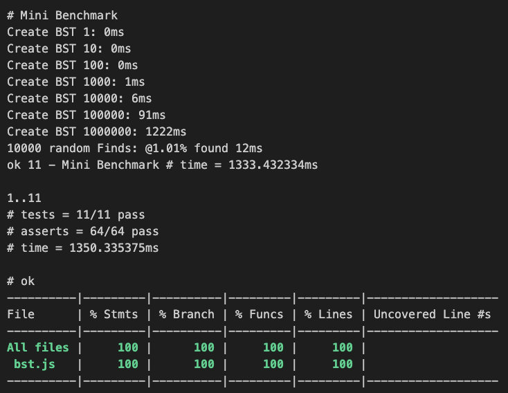
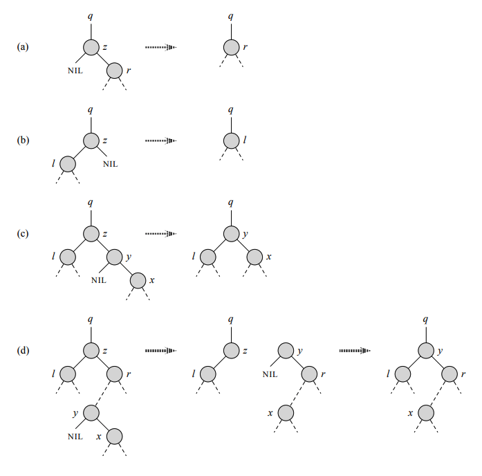

# bst.js
Supports numbers
```sh
npm i @timcash10/bst.js
```
## Includes standard methods of a BST
1. `insert`
1. `find`
1. `traverseInOrder`
1. `successor`
1. `remove`

## Additional methods
1. `deepest` nodes in the BST and depths
1. BST can be constructed from an array of numbers

# Setup
```sh
npm install 
npm test
```

# API
```javascript
// IMPORT
import { BinarySearchTree, Operators, Node } from "./bst.js";

// CREATE
let bst = new BinarySearchTree([10, -10, 5, -5, 42, 360, 0]);

// INSERT
Operators.insert(bst, 100);
Operators.insert(bst, -100);

// TRAVERSE
let ordered = Operators.traverseInOrder(bst);
console.log(ordered); // [-100, -10, -5, 0, 5, 10, 42, 100, 360]

// FIND
const nodeToRemove = Operators.find(bst, 42);

// REMOVE
Operators.remove(bst, nodeToRemove);
let ordered = Operators.traverseInOrder(bst);
console.log(ordered); // [-100, -10, -5, 0, 5, 10, 100, 360]

// DEEPEST
bst = new BinarySearchTree([12, 11, 90, 82, 7, 9]);
let deepest = Operators.deepest(bst);
t.alike(deepest, {keys:[9], depth:3}, "deepest node single");

bst = new BinarySearchTree([26, 82, 16, 92, 33]);
deepest = Operators.deepest(bst);
t.alike(deepest, {keys:[33, 92], depth:2}, "deepest node multiple");
```


# Coverage & Benchmark
> Coverage is reported at the end of each test run

To turn off he benchmark use `skip` on the test


# Binary search tree (BST)
> also called an ordered or sorted binary tree
1. A rooted binary tree data structure 
2. With the key of each internal node being greater than all the keys in the respective node's left subtree and less than the ones in its right subtree. 

The `time complexity` of operations on the binary search tree is directly proportional to the height of the tree.

Binary search trees allow binary search for fast 
1. Lookup (get, search, find, contains)
1. Addition (put, insert, add, append)
1. Removal (delete, remove, pop, extract)

Since the nodes in a BST are laid out so that each comparison skips about half of the remaining tree, the lookup performance is `proportional to that of binary logarithm`. BSTs were devised in the 1960s for the problem of efficient storage of labeled data and are attributed to Conway Berners-Lee and David Wheeler.

The performance of a binary search tree is `dependent on the order of insertion` of the nodes into the tree since arbitrary insertions may lead to degeneracy; several variations of the binary search tree can be built with `guaranteed worst-case performance`. 

> BSTs with guaranteed worst-case complexities perform better than an unsorted array, which would require linear search time.

The complexity analysis of BST shows that, on average, the insert, delete and search takes
1. O(log n) for n nodes 
1. In the worst case they degrade to that of a singly linked list: O(n)

To address the boundless increase of the tree height with arbitrary insertions and deletions, self-balancing variants of BSTs are introduced to bound the worst lookup complexity to that of the binary logarithm. 
1. AVL trees were the first self-balancing binary search trees, invented in 1962 by Georgy Adelson-Velsky and Evgenii Landis.

# Remove


# Search
Searching
Searching in a binary search tree for a specific key can be programmed recursively or iteratively.

# Traversal
A BST can be traversed through three basic algorithms: 
1. inorder 
1. preorder
1. postorder 
tree walks. Inorder tree walk: Nodes from the left subtree get visited first, followed by the root node and right subtree. Preorder tree walk: The root node gets visited first, followed by left and right subtrees.

# Implement abstract data types
1. dynamic sets
1. lookup tables
1. priority queues
1. and used in sorting algorithms such as tree sort.

# Time complexity
The time complexities of a binary search tree increases boundlessly with the tree height if the nodes are inserted in an arbitrary order, therefore 

1. Self-balancing binary search trees were introduced to bound the height of the tree to O(log_n)

2. Various height-balanced binary search trees were introduced to confine the tree height, such as AVL trees, Treaps, and red–black trees.